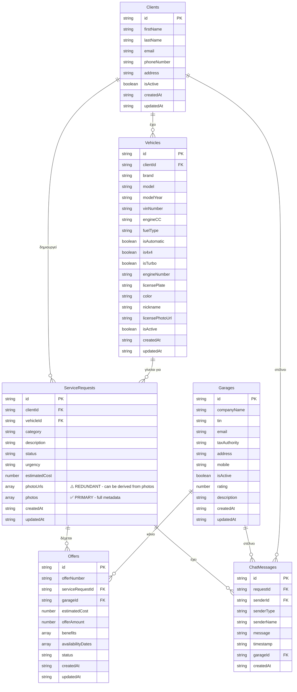

# NextService DynamoDB ER Diagram

## Entity Relationship Diagram

Αυτό το διάγραμμα δείχνει όλες τις σχέσεις μεταξύ των πινάκων στη DynamoDB βάση δεδομένων του NextService.

---

## Visual ER Diagram



---

## Text-Based ER Diagram

```
┌─────────────────────────────────────────────────────────────────────────┐
│                           CLIENTS                                       │
├─────────────────────────────────────────────────────────────────────────┤
│ PK: id (String)                                                         │
│     firstName (String) ✅                                                │
│     lastName (String)                                                   │
│     email (String) [GSI: EmailIndex]                                    │
│     phoneNumber (String) [GSI: PhoneIndex]                              │
│     address (String)                                                     │
│     isActive (Boolean) ✅                                                │
│     createdAt (String) ✅                                                │
│     updatedAt (String) ✅                                                │
└─────────────────────────────────────────────────────────────────────────┘
         │
         │ 1:N (έχει πολλά οχήματα)
         │
         ▼
┌─────────────────────────────────────────────────────────────────────────┐
│                           VEHICLES                                      │
├─────────────────────────────────────────────────────────────────────────┤
│ PK: id (String)                                                         │
│ FK: clientId → Clients.id ✅                                            │
│     brand (String) ✅                                                    │
│     model (String) ✅                                                    │
│     modelYear (String) ✅                                                │
│     vinNumber (String) ✅ [GSI: VINIndex]                                │
│     engineCC (String) ✅                                                 │
│     fuelType (String) ✅                                                 │
│     isAutomatic (Boolean) ✅                                             │
│     is4x4 (Boolean) ✅                                                   │
│     isTurbo (Boolean)                                                   │
│     engineNumber (String)                                                │
│     licensePlate (String)                                                │
│     color (String)                                                       │
│     nickname (String)                                                   │
│     licensePhotoUrl (String)                                             │
│     isActive (Boolean) ✅                                                │
│     createdAt (String) ✅ [GSI: ClientVehiclesIndex RANGE]              │
│     updatedAt (String) ✅                                                │
└─────────────────────────────────────────────────────────────────────────┘
         │
         │ 1:N (έχει πολλά αιτήματα)
         │
         ▼
┌─────────────────────────────────────────────────────────────────────────┐
│                      SERVICEREQUESTS                                     │
├─────────────────────────────────────────────────────────────────────────┤
│ PK: id (String)                                                         │
│ FK: clientId → Clients.id ✅                                            │
│ FK: vehicleId → Vehicles.id ✅                                           │
│     category (String) ✅                                                 │
│     description (String) ✅                                              │
│     status (String) ✅ [GSI: StatusIndex]                                │
│            Values: appointment/pending/in-progress/completed/cancelled   │
│     urgency (String)                                                    │
│     estimatedCost (Number)                                               │
│     photoUrls (Array of Strings) ⚠️ REDUNDANT - μπορεί να αφαιρεθεί     │
│            (μπορεί να εξαχθεί από photos.map(p => p.s3Url))              │
│     photos (Array of Objects) ✅ PRIMARY                                 │
│            [{id, s3Url, s3Key, originalName, fileSize, contentType, ...}]│
│     createdAt (String) ✅ [GSI: ClientRequestsIndex, VehicleRequestsIndex│
│                          StatusIndex RANGE]                              │
│     updatedAt (String) ✅                                                │
└─────────────────────────────────────────────────────────────────────────┘
         │                                    │
         │ 1:N (δέχεται πολλές προσφορές)    │ 1:N (έχει πολλά μηνύματα)
         │                                    │
         ▼                                    ▼
┌──────────────────────────────┐  ┌──────────────────────────────────────┐
│         OFFERS               │  │        CHATMESSAGES                   │
├──────────────────────────────┤  ├──────────────────────────────────────┤
│ PK: id (String)              │  │ PK: id (String)                       │
│ FK: serviceRequestId →       │  │ FK: requestId → ServiceRequests.id ✅ │
│     ServiceRequests.id ✅    │  │ FK: senderId → Clients.id OR          │
│ FK: garageId → Garages.id ✅ │  │              → Garages.id ✅           │
│     offerNumber (String) ✅  │  │ FK: garageId → Garages.id              │
│     estimatedCost (Number)   │  │     senderType (String) ✅            │
│     offerAmount (Number) ✅  │  │            Values: client/garage        │
│     benefits (Array)          │  │     senderName (String) ✅             │
│     availabilityDates (Array)│  │     message (String) ✅                │
│     status (String) ✅       │  │     timestamp (String) ✅              │
│            Values:            │  │            [GSI: RequestMessagesIndex│
│            draft/pending/    │  │             SenderMessagesIndex RANGE] │
│            accepted/rejected │  │     createdAt (String) ✅              │
│     createdAt (String) ✅    │  │                                        │
│            [GSI: ServiceRequest│ │                                        │
│             OffersIndex,      │  │                                        │
│             GarageOffersIndex,│  │                                        │
│             StatusIndex RANGE]│  │                                        │
│     updatedAt (String) ✅    │  │                                        │
└──────────────────────────────┘  └──────────────────────────────────────┘
         │
         │ N:1 (γίνεται από)
         │
         ▼
┌─────────────────────────────────────────────────────────────────────────┐
│                           GARAGES                                       │
├─────────────────────────────────────────────────────────────────────────┤
│ PK: id (String)                                                         │
│     companyName (String) ✅                                              │
│     tin (String) ✅ [GSI: TINIndex]                                      │
│     email (String) ✅                                                    │
│     taxAuthority (String) ✅                                             │
│     address (String) ✅                                                  │
│     mobile (String) ✅ [GSI: MobileIndex]                                │
│     isActive (Boolean) ✅                                                │
│     rating (Number)                                                      │
│     description (String)                                                  │
│     createdAt (String) ✅                                                │
│     updatedAt (String) ✅                                                │
└─────────────────────────────────────────────────────────────────────────┘
```

---

## Σχέσεις μεταξύ των Πινάκων (Foreign Keys)

### 1. **Clients → Vehicles** (1:N)
- **Σχέση**: Ένας πελάτης μπορεί να έχει πολλά οχήματα
- **Foreign Key**: `Vehicles.clientId` → `Clients.id`
- **GSI**: `ClientVehiclesIndex` (HASH: clientId, RANGE: createdAt)

### 2. **Clients → ServiceRequests** (1:N)
- **Σχέση**: Ένας πελάτης μπορεί να κάνει πολλά αιτήματα υπηρεσίας
- **Foreign Key**: `ServiceRequests.clientId` → `Clients.id`
- **GSI**: `ClientRequestsIndex` (HASH: clientId, RANGE: createdAt)

### 3. **Vehicles → ServiceRequests** (1:N)
- **Σχέση**: Ένα όχημα μπορεί να έχει πολλά αιτήματα υπηρεσίας
- **Foreign Key**: `ServiceRequests.vehicleId` → `Vehicles.id`
- **GSI**: `VehicleRequestsIndex` (HASH: vehicleId, RANGE: createdAt)

### 4. **ServiceRequests → Offers** (1:N)
- **Σχέση**: Ένα αίτημα υπηρεσίας μπορεί να δέχεται πολλές προσφορές
- **Foreign Key**: `Offers.serviceRequestId` → `ServiceRequests.id`
- **GSI**: `ServiceRequestOffersIndex` (HASH: serviceRequestId, RANGE: createdAt)
- **Σημασία**: Όταν ένα συνεργείο κάνει προσφορά, συνδέεται με το αίτημα μέσω του `serviceRequestId`

### 5. **Garages → Offers** (1:N)
- **Σχέση**: Ένα συνεργείο μπορεί να κάνει πολλές προσφορές
- **Foreign Key**: `Offers.garageId` → `Garages.id`
- **GSI**: `GarageOffersIndex` (HASH: garageId, RANGE: createdAt)
- **Σημασία**: Κάθε προσφορά συνδέεται με το συνεργείο που την έκανε

### 6. **ServiceRequests → ChatMessages** (1:N)
- **Σχέση**: Ένα αίτημα υπηρεσίας μπορεί να έχει πολλά μηνύματα συνομιλίας
- **Foreign Key**: `ChatMessages.requestId` → `ServiceRequests.id`
- **GSI**: `RequestMessagesIndex` (HASH: requestId, RANGE: timestamp)
- **Σημασία**: Όλη η συνομιλία γίνεται στο πλαίσιο ενός συγκεκριμένου αιτήματος

### 7. **Clients → ChatMessages** (N:1)
- **Σχέση**: Ένας πελάτης μπορεί να στείλει πολλά μηνύματα
- **Foreign Key**: `ChatMessages.senderId` → `Clients.id` (όταν `senderType = 'client'`)
- **GSI**: `SenderMessagesIndex` (HASH: senderId, RANGE: timestamp)

### 8. **Garages → ChatMessages** (N:1)
- **Σχέση**: Ένα συνεργείο μπορεί να στείλει πολλά μηνύματα
- **Foreign Key**: `ChatMessages.senderId` → `Garages.id` (όταν `senderType = 'garage'`)
- **Επιπλέον**: `ChatMessages.garageId` → `Garages.id` (για φιλτράρισμα μηνυμάτων ανά συνεργείο)

---

## Flow: Πώς γίνεται ένα ραντεβού (Appointment Flow)

```
1. CLIENT (Πελάτης)
   └─> Δημιουργεί SERVICE REQUEST (Αίτημα Υπηρεσίας)
       ├─> Συνδέεται με VEHICLE (Όχημα) μέσω vehicleId
       └─> Συνδέεται με CLIENT μέσω clientId

2. SERVICE REQUEST
   └─> Στέλνει SMS σε όλα τα ενεργά GARAGES (Συνεργεία)

3. GARAGE (Συνεργείο)
   └─> Δημιουργεί OFFER (Προσφορά)
       ├─> Συνδέεται με SERVICE REQUEST μέσω serviceRequestId
       └─> Συνδέεται με GARAGE μέσω garageId

4. CLIENT & GARAGE
   └─> Μπορούν να ανταλλάξουν CHAT MESSAGES (Μηνύματα)
       ├─> Συνδέονται με SERVICE REQUEST μέσω requestId
       ├─> CLIENT: senderId → Clients.id, senderType = 'client'
       └─> GARAGE: senderId → Garages.id, senderType = 'garage'

5. CLIENT
   └─> Αποδέχεται OFFER
       └─> SERVICE REQUEST.status = 'appointment' (Ραντεβού προγραμματισμένο)
           └─> Τα μηνύματα γίνονται read-only
```

---

## Global Secondary Indexes (GSI)

### Clients Table
- **EmailIndex**: HASH: `email` - Αναζήτηση με email
- **PhoneIndex**: HASH: `phoneNumber` - Αναζήτηση με τηλέφωνο

### Vehicles Table
- **ClientVehiclesIndex**: HASH: `clientId`, RANGE: `createdAt` - Όλα τα οχήματα ενός πελάτη
- **VINIndex**: HASH: `vinNumber` - Αναζήτηση με VIN

### ServiceRequests Table
- **ClientRequestsIndex**: HASH: `clientId`, RANGE: `createdAt` - Όλα τα αιτήματα ενός πελάτη
- **VehicleRequestsIndex**: HASH: `vehicleId`, RANGE: `createdAt` - Όλα τα αιτήματα ενός οχήματος
- **StatusIndex**: HASH: `status`, RANGE: `createdAt` - Αιτήματα ανά κατάσταση

### Garages Table
- **TINIndex**: HASH: `tin` - Αναζήτηση με ΑΦΜ
- **MobileIndex**: HASH: `mobile` - SMS notifications

### Offers Table
- **ServiceRequestOffersIndex**: HASH: `serviceRequestId`, RANGE: `createdAt` - Όλες οι προσφορές για ένα αίτημα
- **GarageOffersIndex**: HASH: `garageId`, RANGE: `createdAt` - Όλες οι προσφορές ενός συνεργείου
- **StatusIndex**: HASH: `status`, RANGE: `createdAt` - Προσφορές ανά κατάσταση

### ChatMessages Table
- **RequestMessagesIndex**: HASH: `requestId`, RANGE: `timestamp` - Όλα τα μηνύματα ενός αιτήματος
- **SenderMessagesIndex**: HASH: `senderId`, RANGE: `timestamp` - Όλα τα μηνύματα ενός αποστολέα

---

## Σημαντικές Σημειώσεις

### ⚠️ photoUrls vs photos - Redundancy Issue

**Πρόβλημα**: Ο πίνακας `ServiceRequests` έχει **και τα δύο** πεδία:
- `photoUrls`: Array of Strings (απλά URLs)
- `photos`: Array of Objects (πλήρη metadata)

**Γιατί υπάρχουν και τα δύο:**
1. **`photoUrls`**: Χρησιμοποιείται για γρήγορη εμφάνιση (π.χ. `request.photoUrls.map(url => )`)
2. **`photos`**: Περιέχει πλήρη metadata που χρειάζεται για:
   - Διαγραφή από S3 (χρειάζεται `s3Key`)
   - File management (fileSize, contentType, originalName)
   - Audit trail (uploadedAt, description)

**Πρόβλημα**: Είναι **redundant** - τα URLs μπορούν να εξαχθούν από το `photos` array:
```typescript
// Αντί για request.photoUrls
const photoUrls = request.photos.map(p => p.s3Url)
```

**Σύσταση για Refactoring:**
1. **Κρατήστε μόνο το `photos`** (πλήρη metadata)
2. **Αφαιρέστε το `photoUrls`** από τη βάση
3. **Δημιουργήστε helper function** για εξαγωγή URLs:
   ```typescript
   function getPhotoUrls(photos: Photo[]): string[] {
     return photos.map(p => p.s3Url)
   }
   ```
4. **Ενημερώστε όλον τον κώδικα** να χρησιμοποιεί `photos.map(p => p.s3Url)` αντί για `photoUrls`

**Πλεονεκτήματα:**
- ✅ Μείωση redundancy
- ✅ Single source of truth
- ✅ Πιο εύκολη συντήρηση
- ✅ Λιγότερος χώρος στη βάση

**Προσοχή**: Αυτή η αλλαγή απαιτεί migration όλων των υπαρχόντων records.

### Foreign Keys (Ξένα Κλειδιά)
Στη DynamoDB δεν υπάρχουν πραγματικά foreign keys όπως στις SQL βάσεις, αλλά χρησιμοποιούμε:
- **String IDs** που αναφέρονται σε άλλους πίνακες
- **GSI (Global Secondary Indexes)** για γρήγορη αναζήτηση
- **Application-level validation** για να εξασφαλίσουμε την ακεραιότητα των δεδομένων

### Status Values (Τιμές Κατάστασης)

**ServiceRequests.status**:
- `pending` - Αναμονή προσφορών
- `appointment` - Ραντεβού προγραμματισμένο (read-only chat)
- `in-progress` - Υπό εκτέλεση
- `completed` - Ολοκληρωμένο
- `cancelled` - Ακυρωμένο

**Offers.status**:
- `draft` - Προσχέδιο
- `pending` - Αναμονή απάντησης
- `accepted` - Αποδεκτή
- `rejected` - Απορριφθείσα

### ChatMessages.senderType
- `client` - Μήνυμα από πελάτη
- `garage` - Μήνυμα από συνεργείο

---

## Query Patterns (Παραδείγματα Ερωτημάτων)

### 1. Βρες όλα τα οχήματα ενός πελάτη
```
Query: Vehicles table
Index: ClientVehiclesIndex
Key: clientId = "client-123"
```

### 2. Βρες όλα τα αιτήματα ενός πελάτη
```
Query: ServiceRequests table
Index: ClientRequestsIndex
Key: clientId = "client-123"
```

### 3. Βρες όλες τις προσφορές για ένα αίτημα
```
Query: Offers table
Index: ServiceRequestOffersIndex
Key: serviceRequestId = "request-456"
```

### 4. Βρες όλες τις προσφορές ενός συνεργείου
```
Query: Offers table
Index: GarageOffersIndex
Key: garageId = "garage-789"
```

### 5. Βρες όλα τα μηνύματα για ένα αίτημα
```
Query: ChatMessages table
Index: RequestMessagesIndex
Key: requestId = "request-456"
```

### 6. Βρες όλα τα ενεργά συνεργεία για SMS
```
Scan: Garages table
Filter: isActive = true
```

---

*Τελευταία ενημέρωση: Ιανουάριος 2025*
*Έκδοση: 2.0*


