# Logged-in Client Flow

## Overview

This document describes the complete flow for authenticated clients managing service requests, communicating with garages, and accepting offers.

## Entry Points

1. **Login Page** (`/login`) - Email-based authentication
2. **Requests Page** (`/requests/{clientId}`) - Direct access with clientId

## Complete Flow Diagram

```mermaid
flowchart TD
    Start([Client Arrives]) --> LoginPage[Login Page /login]
    
    LoginPage --> SelectUserType{User Type?}
    SelectUserType -->|Client| EnterEmail[Enter Email]
    SelectUserType -->|Garage| GarageFlow[See Garage Flow]
    
    EnterEmail --> CheckAccount[POST /api/auth/login<br/>Check Account Exists]
    
    CheckAccount --> AccountExists{Account Found?}
    
    AccountExists -->|Yes| CheckPendingData{Has Pending<br/>Registration Data?}
    AccountExists -->|No| ShowRegisterOption[Show Registration Option]
    
    CheckPendingData -->|Yes| DeduplicateVehicle[POST /api/auth/register-with-vehicle<br/>Deduplicate Vehicle]
    CheckPendingData -->|No| NormalLogin[Store clientId<br/>in localStorage]
    
    DeduplicateVehicle --> MergeVehicles{Vehicle Match?}
    MergeVehicles -->|VIN Match| LinkByVIN[Link Vehicle by VIN]
    MergeVehicles -->|Engine Match| LinkByEngine[Link Vehicle by Engine]
    MergeVehicles -->|No Match| CreateNewVehicle[Create New Vehicle]
    
    LinkByVIN --> StoreClientId[Store clientId<br/>Refresh User Context]
    LinkByEngine --> StoreClientId
    CreateNewVehicle --> StoreClientId
    NormalLogin --> StoreClientId
    
    ShowRegisterOption --> UserChoice{User Action?}
    UserChoice -->|Register| RegisterNew[POST /api/auth/register<br/>or<br/>POST /api/auth/register-with-vehicle]
    UserChoice -->|Try Another Email| EnterEmail
    
    RegisterNew --> CheckExistingEmail{Email Exists?}
    CheckExistingEmail -->|Yes| MergeAccounts[Merge Guest Account<br/>with Existing Account]
    CheckExistingEmail -->|No| CreateNewAccount[Create New Account]
    
    MergeAccounts --> StoreClientId
    CreateNewAccount --> StoreClientId
    
    StoreClientId --> RedirectToRequests[Redirect to<br/>/requests/clientId]
    
    RedirectToRequests --> RequestsPage[Requests Page]
    
    RequestsPage --> CheckRegistration{Is Registered?}
    CheckRegistration -->|No Email| ShowRegPrompt[Show Registration Prompt]
    CheckRegistration -->|Has Email| ShowRequests[Show Requests List]
    
    ShowRegPrompt --> FillRegistrationForm[Fill Registration Form<br/>Name, Email, Phone]
    FillRegistrationForm --> SubmitRegistration[POST /api/auth/register-from-requests<br/>or<br/>PUT /api/clients/clientId]
    SubmitRegistration --> UpdateUserContext[Update User Context<br/>Mark as Registered]
    UpdateUserContext --> ShowRequests
    
    ShowRequests --> LoadRequests[GET /api/requests?clientId=...]
    LoadRequests --> DisplayTabs[Display Tabs:<br/>Open / Appointment / Closed]
    
    DisplayTabs --> UserAction{User Action?}
    
    UserAction -->|View Details| OpenDetailsModal[Open Request Details Modal]
    UserAction -->|Chat| NavigateToChat[Navigate to<br/>/requests/clientId/chats/requestId]
    UserAction -->|Register| FillRegistrationForm
    
    OpenDetailsModal --> ViewOffers[View Offers from Garages]
    ViewOffers --> AcceptOffer{Accept Offer?}
    
    AcceptOffer -->|Yes| SubmitAcceptance[PATCH /api/requests/requestId/accept-offer<br/>offerId, appointmentDate, appointmentPrice]
    AcceptOffer -->|No| CloseModal[Close Modal]
    
    SubmitAcceptance --> UpdateRequestStatus[Update Request Status<br/>to 'appointment']
    UpdateRequestStatus --> UpdateOffers[Update All Offers:<br/>One 'accepted', Others 'rejected']
    UpdateOffers --> RefreshRequests[Refresh Requests List]
    
    NavigateToChat --> ChatPage[Individual Chat Page]
    ChatPage --> LoadGarages[GET /api/chat/requestId/garages]
    LoadGarages --> SelectGarage[Select Garage from List]
    SelectGarage --> LoadMessages[GET /api/chat/requestId/messages?garageId=...]
    LoadMessages --> SubscribeAppSync[Subscribe to AppSync<br/>Channel: request-requestId-garage-garageId]
    SubscribeAppSync --> ChatInterface[Chat Interface<br/>Real-time Messages]
    
    ChatInterface --> SendMessage{Send Message?}
    SendMessage -->|Yes| POSTMessage[POST /api/chat/requestId/messages<br/>message, senderId, senderType, garageId]
    POSTMessage --> AppSyncBroadcast[AppSync Broadcasts<br/>to Garage]
    AppSyncBroadcast --> ChatInterface
    
    CloseModal --> DisplayTabs
    
    style LoginPage fill:#f9f,stroke:#333,stroke-width:2px
    style RequestsPage fill:#9f9,stroke:#333,stroke-width:2px
    style ChatPage fill:#9ff,stroke:#333,stroke-width:2px
    style SubmitAcceptance fill:#ff9,stroke:#333,stroke-width:2px
```



## Detailed Flows

### 1. Login Flow

**Component:** `src/app/login/components/LoginPage.tsx`

#### Step 1: Email Entry
- User selects "Πελάτης" (default)
- Enters email address
- Clicks "Σύνδεση"

#### Step 2: Account Check
**API:** `POST /api/auth/login`

**Request:**
```json
{
  "email": "user@example.com",
  "userType": "client"
}
```

**Response (Account Found):**
```json
{
  "success": true,
  "user": {
    "id": "client-...",
    "firstName": "John",
    "lastName": "Doe",
    "email": "user@example.com"
  }
}
```

**Response (Account Not Found):**
```json
{
  "success": false,
  "error": "User not found"
}
```

#### Step 3: Handle Pending Registration Data

If account found AND `localStorage` has `pendingRegistrationData`:
- Check if data is less than 1 hour old
- Call `POST /api/auth/register-with-vehicle`
- Attempts vehicle deduplication:
  - Match by VIN Number
  - Match by Engine Number
  - If match found: Link existing vehicle
  - If no match: Create new vehicle

**Vehicle Deduplication:**
```json
{
  "email": "user@example.com",
  "firstName": "John",
  "vehicleData": {
    "id": "vehicle-...",
    "brand": "Toyota",
    "model": "Corolla",
    "vinNumber": "ABC123...",
    "engineNumber": "ENG123..."
  },
  "serviceRequestId": "sr-..."
}
```

#### Step 4: Store Session
- Store `clientId` in `localStorage`
- Call `refreshUser(clientId)` to update UserContext
- Redirect to `/requests/{clientId}`

### 2. Registration Flow

#### Option A: From Login Page (Account Not Found)

**API:** `POST /api/auth/register` or `POST /api/auth/register-with-vehicle`

**If Pending Data Exists:**
- Uses `register-with-vehicle` endpoint
- Handles vehicle deduplication
- Merges guest requests with new account

**If No Pending Data:**
- Uses standard `register` endpoint
- Creates new client account

#### Option B: From Requests Page (Guest User)

**Component:** `src/app/requests/components/RequestsPage.tsx`

**Registration Form Fields:**
- First Name (required)
- Last Name (optional)
- Email (required for notifications)
- Phone Number (optional, for SMS)

**API:** `POST /api/auth/register-from-requests`

**Request:**
```json
{
  "guestClientId": "client-...",
  "email": "user@example.com",
  "firstName": "John",
  "lastName": "Doe",
  "phoneNumber": "6912345678"
}
```

**Process:**
1. Check if email already exists
2. If exists: Merge guest account with existing account
3. If not exists: Create new account with email
4. Attempt vehicle deduplication
5. Update all guest requests to new account
6. Return merged client data

**Response:**
```json
{
  "success": true,
  "client": {
    "id": "client-...",
    "email": "user@example.com",
    ...
  },
  "isExistingUser": true,
  "vehicleDeduplicated": true,
  "vehicleMatchReason": "VIN"
}
```

### 3. Requests Page Flow

**Component:** `src/app/requests/[clientId]/page.tsx` → `RequestsPage`

#### Page Load
1. Store `clientId` in `localStorage`
2. Check if user is registered (has email)
3. Load requests: `GET /api/requests?clientId={clientId}`
4. Check for garage messages: `GET /api/chat/{requestId}/garages`

#### Tabs
- **Ανοιχτά (Open):** `pending` or `in-progress` status
- **Ραντεβού (Appointment):** `appointment` status
- **Περασμένα (Closed):** `completed` or `cancelled` status

#### Request Card Actions
- **View Details:** Opens modal with full request information
- **Chat:** Navigate to chat page
- **Badge:** Shows if garage has sent messages

### 4. Request Details Modal

**Component:** `src/app/requests/components/RequestDetailsModal.tsx`

**Shows:**
- Request description
- Vehicle details
- Photos
- Status
- Offers from garages
- Client availability dates

**Offer Display:**
- Garage company name
- Offer price
- Benefits included
- Availability dates
- Accept/Reject buttons

### 5. Accept Offer Flow

**API:** `PATCH /api/requests/{requestId}/accept-offer`

**Request:**
```json
{
  "offerId": "offer-...",
  "appointmentDate": "2024-12-25",
  "appointmentPrice": 150
}
```

**Backend Process:**
1. Update ServiceRequest:
   - Status → `appointment`
   - `acceptedOfferId` → offerId
   - `appointmentDate` → date
   - `appointmentPrice` → price

2. Update All Offers:
   - Accepted offer → `status: 'accepted'`
   - All other offers → `status: 'rejected'`

3. Return updated request

**Result:**
- Request moves to "Ραντεβού" tab
- Chat becomes read-only
- Garage notified (via AppSync)

### 6. Chat Flow

**Component:** `src/app/requests/[clientId]/chats/[requestId]/components/IndividualChatPage.tsx`

#### Page Load
1. Load request details: `GET /api/requests/{requestId}`
2. Load garages with messages: `GET /api/chat/{requestId}/garages`
3. Select first garage (if available)
4. Load messages: `GET /api/chat/{requestId}/messages?garageId={garageId}`
5. Subscribe to AppSync channel: `request-{requestId}-garage-{garageId}`

#### Garage Selection
- Sidebar shows all garages that have sent messages
- Click garage to switch conversation
- Unread indicator shows if garage has unread messages

#### Real-time Messaging
**Sending Message:**
- `POST /api/chat/{requestId}/messages`
- Message stored in DynamoDB
- AppSync broadcasts to garage

**Receiving Message:**
- AppSync subscription receives new messages
- Messages added to chat interface
- Auto-scroll to bottom

**Read Status:**
- Mark as read when garage selected: `POST /api/chat/{requestId}/mark-read`
- Updates unread count

#### Chat Restrictions
- If request status = `appointment`: Chat is read-only
- Cannot send new messages after appointment scheduled

### 7. Navigation

**Component:** `src/components/ClientNavigation.tsx`

**Navigation Items:**
- **Αιτήματα:** `/requests/{clientId}` (default tab: Open)
- **Ραντεβού:** `/requests/{clientId}?tab=appointment`
- **Συνομιλίες:** `/requests/{clientId}/chats`

## User Context Management

**Component:** `src/contexts/UserContext.tsx`

**State:**
```typescript
{
  user: {
    id: string
    firstName: string
    lastName?: string
    email?: string
    phoneNumber?: string
    isRegistered: boolean
  }
  isLoading: boolean
  setUser: (user) => void
  refreshUser: (clientId) => Promise<void>
}
```

**Initialization:**
- On app load, checks `localStorage` for `clientId`
- If found, calls `refreshUser(clientId)`
- Fetches client data from `/api/clients/{clientId}`

## Key API Endpoints

- `POST /api/auth/login` - Authenticate user
- `POST /api/auth/register` - Create new account
- `POST /api/auth/register-with-vehicle` - Register with vehicle deduplication
- `POST /api/auth/register-from-requests` - Register from requests page
- `GET /api/requests?clientId={id}` - Get all requests
- `GET /api/requests/{requestId}` - Get request details
- `PATCH /api/requests/{requestId}/accept-offer` - Accept offer
- `GET /api/chat/{requestId}/garages` - Get garages with messages
- `GET /api/chat/{requestId}/messages?garageId={id}` - Get messages
- `POST /api/chat/{requestId}/messages` - Send message
- `POST /api/chat/{requestId}/mark-read` - Mark messages as read

## Key Files

- `src/app/login/components/LoginPage.tsx`
- `src/app/requests/[clientId]/page.tsx`
- `src/app/requests/components/RequestsPage.tsx`
- `src/app/requests/components/RequestDetailsModal.tsx`
- `src/app/requests/components/RequestDetailsContent.tsx`
- `src/app/requests/[clientId]/chats/[requestId]/components/IndividualChatPage.tsx`
- `src/contexts/UserContext.tsx`
- `src/components/ClientNavigation.tsx`
- `src/app/api/auth/login/route.ts`
- `src/app/api/auth/register-from-requests/route.ts`
- `src/app/api/requests/[requestId]/accept-offer/route.ts`

## State Management

- **localStorage:**
  - `clientId` - Current user session
  - `pendingRegistrationData` - Guest request data for deduplication

- **React Context:**
  - User state (name, email, registration status)

- **Component State:**
  - Requests list
  - Selected request
  - Chat messages
  - Active tab

## Next Steps

After managing requests, clients can:
1. Continue chatting with garages
2. Accept offers and schedule appointments
3. View appointment details in "Ραντεβού" tab
4. Create new service requests from landing page


