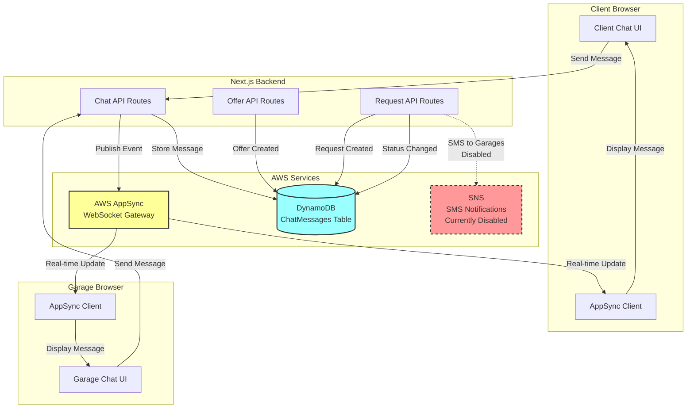
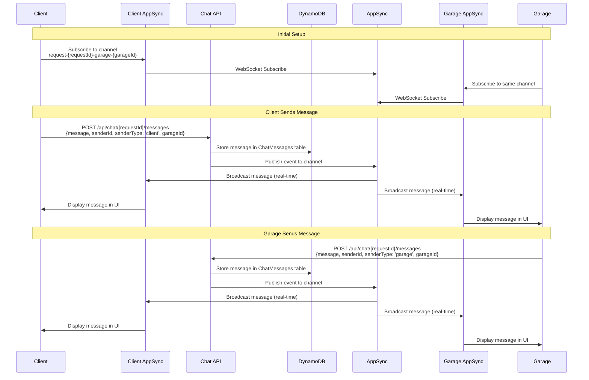
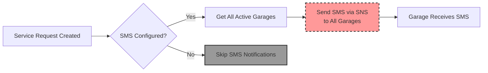

# Communication Flow

## Overview

This document describes the real-time communication architecture between clients and garages, including chat messaging, notifications, and offer updates.

## Communication Architecture



## Real-time Chat Flow

### Channel Naming Convention

**Format:** `request-{requestId}-garage-{garageId}`

**Example:** `request-sr-1234567890-abc-garage-garage-9876543210-xyz`

**Why this format?**
- Each conversation is unique to a specific request and garage
- Client can have multiple conversations (one per garage)
- Garage can have multiple conversations (one per request)
- Isolates messages per conversation

### Message Flow Diagram



## Detailed Chat Flow

### 1. Client Initiates Chat

**Component:** `src/app/requests/[clientId]/chats/[requestId]/components/IndividualChatPage.tsx`

#### Step 1: Load Garages
**API:** `GET /api/chat/{requestId}/garages`

**Returns:** List of garages that have sent messages for this request

**Response:**
```json
{
  "garages": [
    {
      "id": "garage-...",
      "companyName": "ABC Auto Service",
      "logoUrl": "...",
      "lastMessage": "We can help with this",
      "lastMessageTime": "2024-12-25T10:00:00Z",
      "hasUnreadMessages": true
    }
  ]
}
```

#### Step 2: Select Garage
- User clicks on garage from sidebar
- Load messages for selected garage
- Subscribe to AppSync channel

#### Step 3: Load Messages
**API:** `GET /api/chat/{requestId}/messages?garageId={garageId}`

**Response:**
```json
{
  "success": true,
  "messages": [
    {
      "id": "msg-...",
      "requestId": "sr-...",
      "senderId": "garage-...",
      "senderType": "garage",
      "senderName": "ABC Auto Service",
      "message": "Hello, we can help",
      "timestamp": "2024-12-25T10:00:00Z",
      "garageId": "garage-..."
    }
  ]
}
```

#### Step 4: Subscribe to Real-time Updates
**Channel:** `request-{requestId}-garage-{garageId}`

**Code:**
```typescript
const channelName = `request-${requestId}-garage-${garageId}`
appSyncService.subscribe(channelName, (newMessage: ChatMessage) => {
  // Add message to UI
  setMessages(prev => [...prev, newMessage])
})
```

#### Step 5: Mark as Read
**API:** `POST /api/chat/{requestId}/mark-read`

**Request:**
```json
{
  "garageId": "garage-..."
}
```

**Process:**
- Updates unread message count
- Removes unread indicator

### 2. Garage Initiates Chat

**Component:** `src/app/garage-dashboard/[garageId]/chat/[requestId]/components/ChatPage.tsx`

#### Similar Flow to Client
- Load request details
- Load garage data
- Load messages
- Subscribe to AppSync channel
- Real-time message updates

### 3. Sending Messages

#### Client Sends Message

**API:** `POST /api/chat/{requestId}/messages`

**Request:**
```json
{
  "message": "Hello, when can you start?",
  "senderId": "client-...",
  "senderType": "client",
  "garageId": "garage-..."
}
```

**Backend Process:**
1. Validate request status (cannot send if `appointment`)
2. Get sender name from database
3. Generate message ID: `msg-{timestamp}-{random}`
4. Store in DynamoDB (ChatMessages table)
5. Publish to AppSync channel
6. Return success

**Response:**
```json
{
  "success": true,
  "message": {
    "id": "msg-...",
    "requestId": "sr-...",
    "senderId": "client-...",
    "senderType": "client",
    "senderName": "John Doe",
    "message": "Hello, when can you start?",
    "timestamp": "2024-12-25T10:05:00Z",
    "garageId": "garage-..."
  }
}
```

#### Garage Sends Message

**Similar process, but:**
- `senderType: "garage"`
- `senderId: garageId`
- Sender name from Garages table

### 4. Real-time Message Reception

#### AppSync Subscription

**Service:** `src/lib/appsync-service.ts`

**Connection:**
- WebSocket connection to AppSync endpoint
- Uses API key authentication
- Supports local development server

**Subscription:**
```typescript
appSyncService.subscribe(channelName, (newMessage: ChatMessage) => {
  // Prevent duplicates
  if (messages.some(msg => msg.id === newMessage.id)) {
    return
  }
  
  // Add new message
  setMessages(prev => [...prev, newMessage].sort((a, b) => 
    new Date(a.timestamp).getTime() - new Date(b.timestamp).getTime()
  ))
})
```

**Message Handling:**
- Checks for duplicate messages (by ID)
- Sorts messages by timestamp
- Updates UI in real-time
- Auto-scrolls to bottom

### 5. Read/Unread Status

#### Unread Message Tracking

**For Clients:**
- Check if garage has sent messages: `GET /api/chat/{requestId}/garages`
- `hasUnreadMessages` flag indicates unread messages
- Badge shown on request card

**For Garages:**
- Similar unread tracking (if implemented)

#### Marking as Read

**When:**
- Client selects garage in chat
- Garage opens chat page
- User views messages

**API:** `POST /api/chat/{requestId}/mark-read`

**Process:**
- Updates read status in database
- Removes unread indicators
- Updates UI

## Notification Flow

### Service Request Creation Notifications

**Current Status:** Disabled

**Intended Flow:**


**API:** `POST /api/service-request`

**Current Implementation:**
```typescript
// SMS notifications disabled
const notificationResult = {
  successful: 0,
  failed: 0,
  errors: ['SMS notifications disabled - SNS not configured on AWS yet'],
  summary: 'SMS notifications disabled - SNS not configured on AWS yet'
}
```

**Future Implementation:**
- When SNS is configured, would send SMS to all registered garages
- SMS would include: Vehicle info, category, description
- Garages would receive notification immediately

### Offer Creation Notifications

**Current Implementation:** Real-time via AppSync

**Flow:**
1. Garage creates offer
2. Offer saved to DynamoDB
3. Client sees offer in request details (on page refresh)
4. No push notification currently

**Future Enhancement:**
- Could add AppSync notification when offer created
- Client would see real-time offer update

### Offer Acceptance Notifications

**Current Implementation:** Status change visible in real-time

**Flow:**
1. Client accepts offer
2. Request status → `appointment`
3. All offers updated (one accepted, others rejected)
4. Garage sees status change in dashboard
5. Chat becomes read-only

**Notification:**
- Status change visible in "My Offers" tab
- Real-time update via AppSync (if implemented)

## AppSync Configuration

### Environment Variables

```env
NEXT_PUBLIC_APPSYNC_WEBSOCKET_ENDPOINT=wss://...
NEXT_PUBLIC_APPSYNC_API_KEY=...
NEXT_PUBLIC_APPSYNC_GRAPHQL_ENDPOINT=https://...
```

### Connection Types

**Local Development:**
- Uses local AppSync server (`localhost:3002`)
- Simple WebSocket connection
- Message type: `start` / `stop`

**Production (AWS):**
- Uses AWS AppSync Events
- WebSocket with authorization protocol
- Message type: `subscribe` / `unsubscribe`

### Message Types

**Subscription:**
```json
{
  "id": "sub-...",
  "type": "subscribe",
  "channel": "/default/request-{requestId}-garage-{garageId}",
  "authorization": {
    "x-api-key": "...",
    "host": "..."
  }
}
```

**Publish:**
```json
{
  "id": "msg-...",
  "type": "publish",
  "channel": "/default/request-{requestId}-garage-{garageId}",
  "events": [JSON.stringify(message)],
  "authorization": {
    "x-api-key": "...",
    "host": "..."
  }
}
```

## Database Schema

### ChatMessages Table

**Primary Key:** `id` (message ID)

**Attributes:**
- `id`: string (msg-timestamp-random)
- `requestId`: string (service request ID)
- `senderId`: string (client or garage ID)
- `senderType`: string ('client' | 'garage')
- `senderName`: string (display name)
- `message`: string (message text)
- `timestamp`: string (ISO timestamp)
- `garageId`: string (garage ID for conversation)
- `createdAt`: string (ISO timestamp)

**Query Patterns:**
- Get messages by `requestId` and `garageId`
- Filter by sender type
- Sort by timestamp

## Error Handling

### Connection Failures

**AppSync Connection:**
- Automatic reconnection attempts (max 5)
- Exponential backoff
- Falls back to polling if WebSocket fails

### Message Send Failures

**If AppSync publish fails:**
- Message still saved to DynamoDB
- Error logged but request succeeds
- Client/Garage can refresh to see message

### Read-Only Mode

**When request status = `appointment`:**
- Chat API returns 403 error
- UI shows read-only notice
- Cannot send new messages

## Key Files

- `src/lib/appsync-service.ts` - AppSync WebSocket service
- `src/lib/websocket-service.ts` - WebSocket utilities
- `src/app/api/chat/[requestId]/messages/route.ts` - Chat API
- `src/app/api/chat/[requestId]/garages/route.ts` - Get garages
- `src/app/api/chat/[requestId]/mark-read/route.ts` - Mark as read
- `src/hooks/useRealtimeChat.ts` - React hook for chat
- `src/app/requests/[clientId]/chats/[requestId]/components/IndividualChatPage.tsx` - Client chat UI
- `src/app/garage-dashboard/[garageId]/chat/[requestId]/components/ChatPage.tsx` - Garage chat UI

## Performance Considerations

### Message Loading
- Loads all messages for conversation on page load
- Could be optimized with pagination for long conversations

### Real-time Updates
- Single WebSocket connection per browser tab
- Multiple subscriptions per connection
- Automatic cleanup on component unmount

### Duplicate Prevention
- Checks message ID before adding to UI
- Prevents duplicate messages from multiple sources

## Future Enhancements

1. **Push Notifications:**
   - Browser push notifications for new messages
   - Mobile app notifications

2. **Message Status:**
   - Delivered status
   - Read receipts
   - Typing indicators

3. **File Attachments:**
   - Image sharing
   - Document uploads

4. **Message Search:**
   - Search within conversations
   - Full-text search

5. **Message History:**
   - Pagination for long conversations
   - Archive old messages


