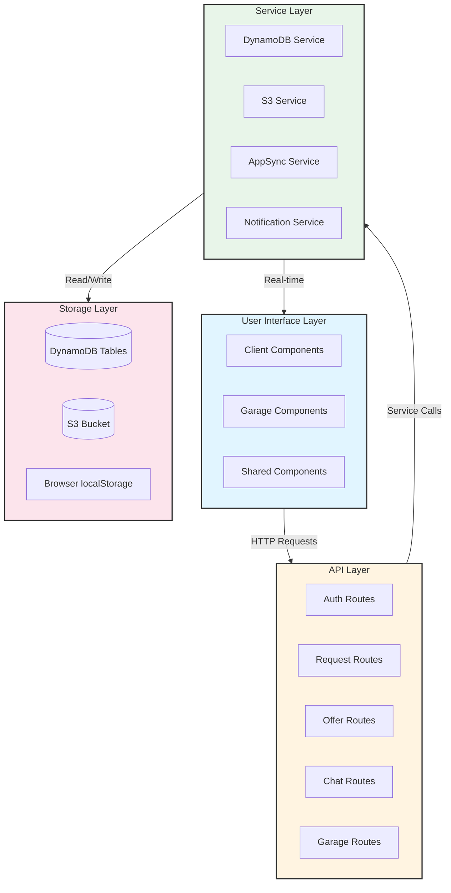
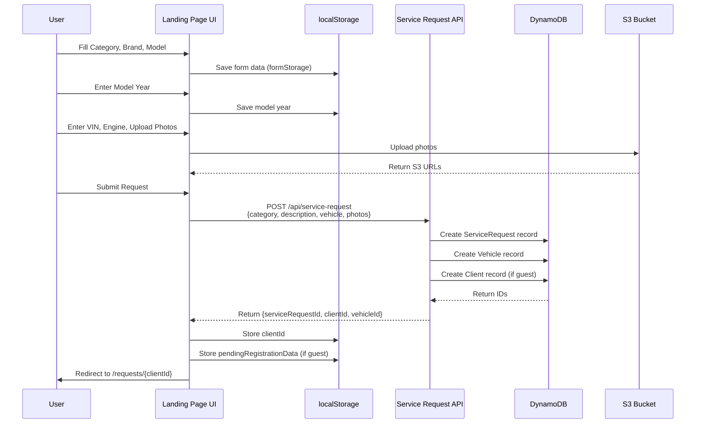
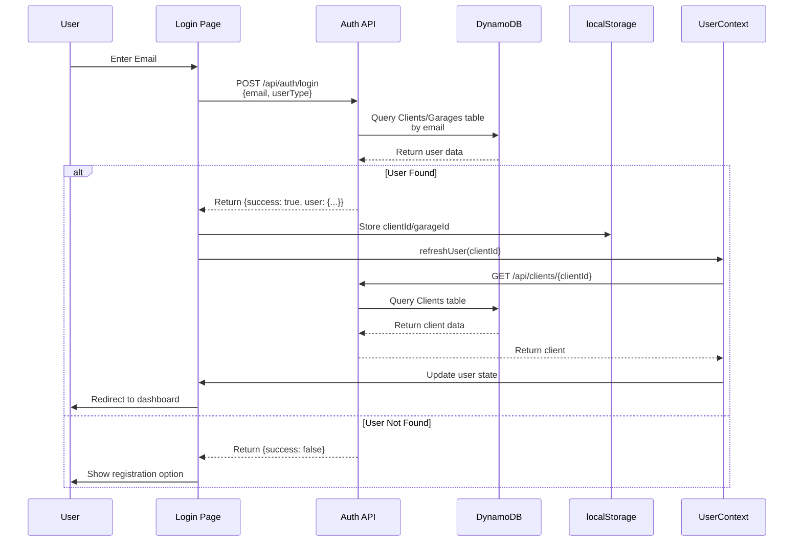
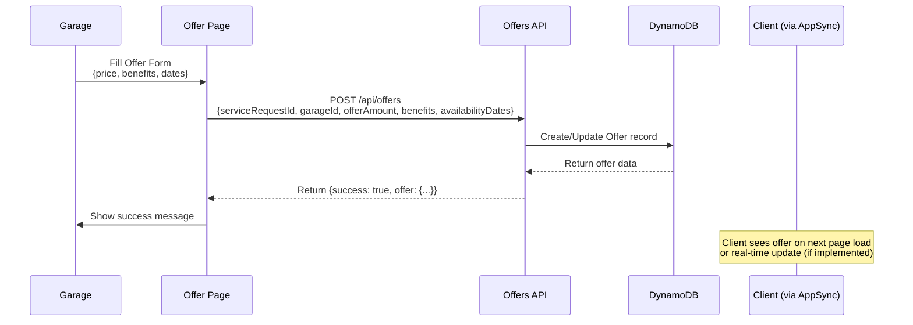
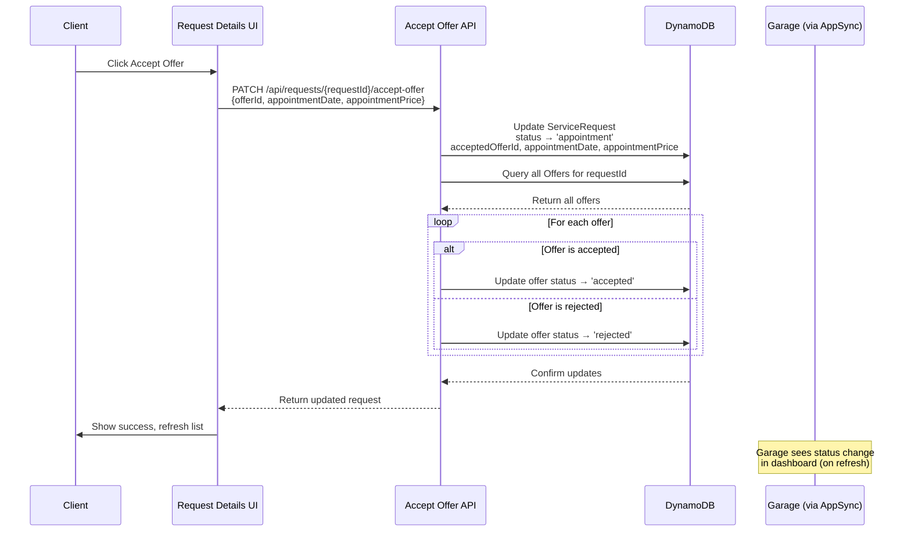
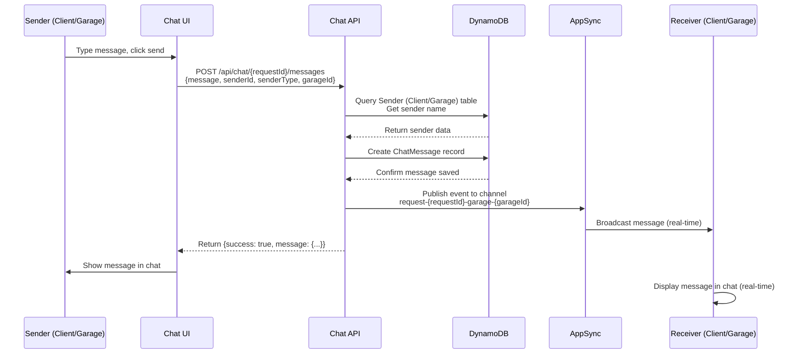
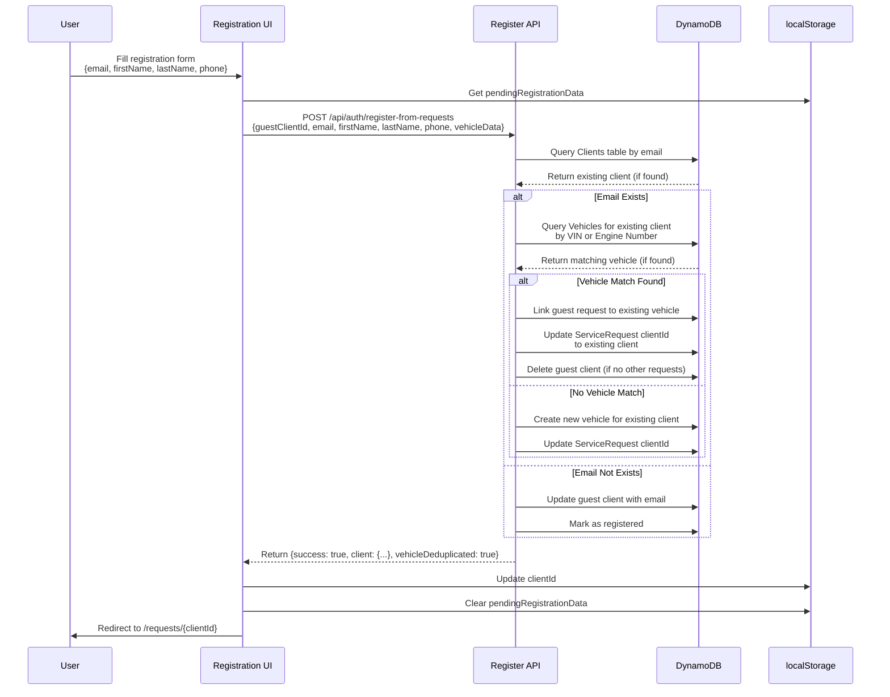
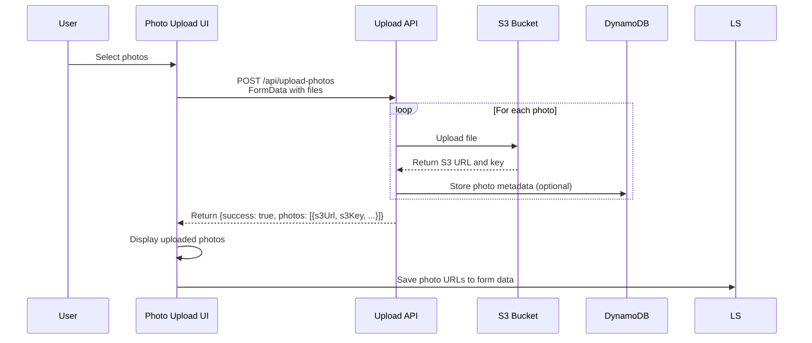
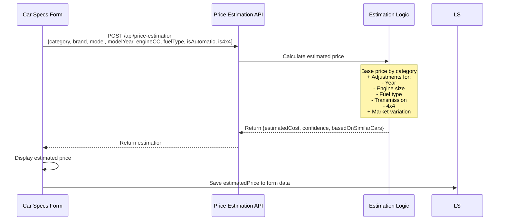

# Data Flow Documentation

## Overview

This document describes how data flows through the NextService application, from user interactions to database storage and real-time updates.

## Data Flow Architecture



## Service Request Creation Flow

### Complete Data Flow



### Data Structures

**Form Data (localStorage):**
```json
{
  "category": "service",
  "description": "Service description",
  "brand": "toyota",
  "model": "Corolla",
  "modelYear": "2020",
  "vinNumber": "ABC123...",
  "engineNumber": "ENG123...",
  "engineCC": "1800",
  "fuelType": "petrol",
  "isAutomatic": false,
  "is4x4": false,
  "estimatedPrice": 150
}
```

**ServiceRequest (DynamoDB):**
```json
{
  "id": "sr-timestamp-random",
  "clientId": "client-timestamp-random",
  "vehicleId": "vehicle-timestamp-random",
  "category": "service",
  "description": "Service description",
  "status": "pending",
  "estimatedCost": 150,
  "photoUrls": ["s3://bucket/key"],
  "photos": [{
    "id": "photo-id",
    "s3Url": "https://...",
    "s3Key": "key",
    "originalName": "photo.jpg",
    "fileSize": 12345,
    "contentType": "image/jpeg",
    "uploadedAt": "2024-12-25T10:00:00Z"
  }],
  "createdAt": "2024-12-25T10:00:00Z",
  "updatedAt": "2024-12-25T10:00:00Z"
}
```

**Vehicle (DynamoDB):**
```json
{
  "id": "vehicle-timestamp-random",
  "clientId": "client-timestamp-random",
  "brand": "Toyota",
  "model": "Corolla",
  "modelYear": "2020",
  "vinNumber": "ABC123...",
  "engineNumber": "ENG123...",
  "engineCC": "1800",
  "fuelType": "petrol",
  "isAutomatic": false,
  "is4x4": false,
  "isActive": true,
  "createdAt": "2024-12-25T10:00:00Z",
  "updatedAt": "2024-12-25T10:00:00Z"
}
```

**Client (DynamoDB - Guest):**
```json
{
  "id": "client-timestamp-random",
  "firstName": "Επισκέπτης",
  "isActive": true,
  "createdAt": "2024-12-25T10:00:00Z",
  "updatedAt": "2024-12-25T10:00:00Z"
}
```

## Login & Authentication Flow

### Data Flow



### Session Management

**localStorage Keys:**
- `clientId`: Current client session ID
- `garageId`: Current garage session ID
- `pendingRegistrationData`: Guest request data for deduplication

**UserContext State:**
```typescript
{
  user: {
    id: string
    firstName: string
    lastName?: string
    email?: string
    phoneNumber?: string
    isRegistered: boolean
  }
  isLoading: boolean
}
```

## Offer Creation Flow

### Data Flow



### Offer Data Structure

**Offer (DynamoDB):**
```json
{
  "id": "offer-timestamp-random",
  "offerNumber": "Offer_251224_5",
  "serviceRequestId": "sr-...",
  "garageId": "garage-...",
  "estimatedCost": 150,
  "offerAmount": 140,
  "currency": "EUR",
  "status": "pending",
  "benefits": ["Free pickup", "Warranty"],
  "availabilityDates": ["2024-12-26", "2024-12-27"],
  "createdAt": "2024-12-25T10:00:00Z",
  "updatedAt": "2024-12-25T10:00:00Z"
}
```

## Offer Acceptance Flow

### Data Flow



### Status Update Data

**ServiceRequest Update:**
```json
{
  "status": "appointment",
  "acceptedOfferId": "offer-...",
  "appointmentDate": "2024-12-25",
  "appointmentPrice": 150,
  "updatedAt": "2024-12-25T10:05:00Z"
}
```

**Offers Update:**
```json
// Accepted offer
{
  "id": "offer-...",
  "status": "accepted",
  "appointmentDate": "2024-12-25",
  "appointmentPrice": 150
}

// Rejected offers
{
  "id": "offer-other-...",
  "status": "rejected"
}
```

## Chat Message Flow

### Data Flow



### Chat Message Data Structure

**ChatMessage (DynamoDB):**
```json
{
  "id": "msg-timestamp-random",
  "requestId": "sr-...",
  "senderId": "client-...",
  "senderType": "client",
  "senderName": "John Doe",
  "message": "Hello, when can you start?",
  "timestamp": "2024-12-25T10:00:00Z",
  "garageId": "garage-...",
  "createdAt": "2024-12-25T10:00:00Z"
}
```

## Registration with Vehicle Deduplication Flow

### Data Flow



## Photo Upload Flow

### Data Flow



### Photo Metadata Structure

```json
{
  "id": "photo-timestamp-random",
  "s3Url": "https://bucket.s3.amazonaws.com/key",
  "s3Key": "uploads/request-id/photo.jpg",
  "originalName": "photo.jpg",
  "fileSize": 123456,
  "contentType": "image/jpeg",
  "description": "Front view",
  "uploadedAt": "2024-12-25T10:00:00Z"
}
```

## Price Estimation Flow

### Data Flow



### Price Estimation Data

**Request:**
```json
{
  "category": "service",
  "brand": "toyota",
  "model": "Corolla",
  "modelYear": "2020",
  "engineCC": "1800",
  "fuelType": "petrol",
  "isAutomatic": false,
  "is4x4": false
}
```

**Response:**
```json
{
  "success": true,
  "estimation": {
    "estimatedCost": 150,
    "currency": "EUR",
    "confidence": "high",
    "basedOnSimilarCars": 20,
    "category": "service"
  }
}
```

## Data Query Patterns

### Client Requests Query

**API:** `GET /api/requests?clientId={clientId}`

**DynamoDB Query:**
```typescript
ScanCommand({
  TableName: 'ServiceRequests',
  FilterExpression: 'clientId = :clientId',
  ExpressionAttributeValues: {
    ':clientId': clientId
  }
})
```

**Then for each request:**
- Query Vehicles table for vehicle details
- Query Offers table for offers
- Query ChatMessages for unread count

### Available Requests Query (Garage)

**API:** `GET /api/garage/available-requests?garageId={garageId}`

**DynamoDB Query:**
```typescript
// Get all pending/in-progress requests
ScanCommand({
  TableName: 'ServiceRequests',
  FilterExpression: 'status IN (:pending, :inProgress)',
  ExpressionAttributeValues: {
    ':pending': 'pending',
    ':inProgress': 'in-progress'
  }
})

// Filter out requests where garage already made offer
// Query Offers table for garageId + serviceRequestId
```

### Chat Messages Query

**API:** `GET /api/chat/{requestId}/messages?garageId={garageId}`

**DynamoDB Query:**
```typescript
ScanCommand({
  TableName: 'ChatMessages',
  FilterExpression: 'requestId = :requestId AND (senderId = :garageId OR (senderType = :clientType AND garageId = :garageId))',
  ExpressionAttributeValues: {
    ':requestId': requestId,
    ':garageId': garageId,
    ':clientType': 'client'
  }
})
```

## Data Synchronization

### Real-time Updates

**AppSync Channels:**
- `request-{requestId}-garage-{garageId}` - Chat messages

**Update Flow:**
1. Data change in DynamoDB
2. API publishes event to AppSync
3. AppSync broadcasts to subscribed clients
4. UI updates in real-time

### Polling Fallback

**If AppSync unavailable:**
- Components can poll API endpoints
- Refresh on user interaction
- Periodic background refresh

## Data Validation

### Client-Side Validation

**Form Validation:**
- Required fields
- Format validation (email, phone, VIN)
- File size/type for uploads

**Storage:** Form data in `localStorage` until submission

### Server-Side Validation

**API Validation:**
- Required fields
- Data types
- Business rules (status transitions)
- Authorization checks

**Storage:** Validated data in DynamoDB

## Error Handling

### Data Flow Errors

**Network Errors:**
- Retry logic
- Error messages to user
- Fallback to cached data

**Validation Errors:**
- Clear error messages
- Highlight invalid fields
- Prevent invalid submissions

**Database Errors:**
- Transaction rollback (if implemented)
- Error logging
- User-friendly error messages

## Key Files

**API Routes:**
- `src/app/api/service-request/route.ts`
- `src/app/api/auth/login/route.ts`
- `src/app/api/auth/register-from-requests/route.ts`
- `src/app/api/offers/route.ts`
- `src/app/api/requests/[requestId]/accept-offer/route.ts`
- `src/app/api/chat/[requestId]/messages/route.ts`

**Services:**
- `src/utils/dynamoService.ts`
- `src/utils/s3Service.ts`
- `src/lib/appsync-service.ts`
- `src/utils/formStorage.ts`

**Components:**
- `src/app/requests/components/RequestsPage.tsx`
- `src/app/garage-dashboard/[garageId]/components/AvailableRequests.tsx`
- `src/contexts/UserContext.tsx`

## Performance Considerations

### Data Loading

**Optimization Strategies:**
- Lazy loading of request details
- Pagination for long lists
- Caching frequently accessed data
- Batch queries where possible

### Real-time Updates

**Efficiency:**
- Single WebSocket connection
- Channel-based subscriptions
- Message deduplication
- Efficient reconnection logic

### Storage Optimization

**localStorage:**
- Clean up old form data
- Limit stored data size
- Clear on logout

**DynamoDB:**
- Efficient query patterns
- Index optimization
- Data archiving for old records


