# Garage Flow

## Overview

This document describes the complete flow for garage (professional service provider) users managing service requests, creating offers, and communicating with clients.

## Entry Points

1. **Login Page** (`/login`) - Email-based authentication with user type selector
2. **Professional Registration** (`/register-professional`) - New garage registration
3. **Garage Dashboard** (`/garage-dashboard/{garageId}`) - Direct access with garageId

## Complete Flow Diagram

```mermaid
flowchart TD
    Start([Garage Arrives]) --> LoginPage[Login Page /login]
    
    LoginPage --> SelectGarageType[Select 'Συνεργείο'<br/>User Type]
    SelectGarageType --> EnterEmail[Enter Email]
    EnterEmail --> CheckGarageAccount[POST /api/auth/login<br/>userType: 'garage']
    
    CheckGarageAccount --> GarageExists{Garage Found?}
    
    GarageExists -->|Yes| StoreGarageId[Store garageId<br/>in localStorage]
    GarageExists -->|No| ShowRegisterOption[Show Registration Option]
    
    ShowRegisterOption --> UserChoice{User Action?}
    UserChoice -->|Register| NavigateToRegister[Navigate to<br/>/register-professional]
    UserChoice -->|Try Another Email| EnterEmail
    
    NavigateToRegister --> RegisterForm[Professional Registration Form]
    RegisterForm --> FillGarageInfo[Fill Garage Information:<br/>Company Name, AΦM, Email,<br/>ΔΟΥ, Address, Mobile]
    FillGarageInfo --> ValidateForm{Form Valid?}
    
    ValidateForm -->|No| ShowErrors[Show Validation Errors]
    ValidateForm -->|Yes| SubmitRegistration[POST /api/auth/register-professional]
    
    ShowErrors --> FillGarageInfo
    SubmitRegistration --> RegistrationSuccess[Registration Success<br/>Await Activation]
    RegistrationSuccess --> ReturnToHome[Return to Home]
    
    StoreGarageId --> RedirectToDashboard[Redirect to<br/>/garage-dashboard/garageId]
    
    RedirectToDashboard --> DashboardPage[Garage Dashboard]
    DashboardPage --> CheckAuth{Garage Authenticated?}
    
    CheckAuth -->|No| RedirectToLogin[Redirect to /login]
    CheckAuth -->|Yes| LoadGarageData[Load Garage Data<br/>GET /api/garage/garageId]
    
    LoadGarageData --> DisplayTabs[Display Tabs:<br/>My Offers / Available / Settings]
    
    DisplayTabs --> TabSelection{Selected Tab?}
    
    TabSelection -->|My Offers| MyOffersTab[My Offers Tab]
    TabSelection -->|Available| AvailableRequestsTab[Available Requests Tab]
    TabSelection -->|Settings| SettingsTab[Settings Tab]
    
    MyOffersTab --> LoadMyOffers[GET /api/garage/offers?garageId=...]
    LoadMyOffers --> DisplayOffers[Display Offers List<br/>Filter: All / Pending / Accepted / Rejected]
    DisplayOffers --> OfferAction{User Action?}
    OfferAction -->|View/Edit Offer| NavigateToOffer[Navigate to<br/>/garage-dashboard/garageId/offers/requestId]
    OfferAction -->|Chat| NavigateToChat[Navigate to<br/>/garage-dashboard/garageId/chat/requestId]
    
    AvailableRequestsTab --> LoadAvailableRequests[GET /api/garage/available-requests?garageId=...]
    LoadAvailableRequests --> DisplayRequests[Display Available Requests<br/>Filter by Category]
    DisplayRequests --> RequestAction{User Action?}
    RequestAction -->|Make Offer| NavigateToOffer
    RequestAction -->|Chat| NavigateToChat
    RequestAction -->|View Details| NavigateToOffer
    
    NavigateToOffer --> OfferPage[Offer Page]
    OfferPage --> LoadRequestData[Load Request Data<br/>GET /api/requests/requestId]
    LoadRequestData --> LoadGarageData2[Load Garage Data<br/>GET /api/garage/garageId]
    LoadGarageData2 --> CheckExistingOffer{Offer Exists?}
    
    CheckExistingOffer -->|Yes| LoadExistingOffer[Load Existing Offer<br/>Pre-fill Form]
    CheckExistingOffer -->|No| ShowEmptyForm[Show Empty Form]
    
    LoadExistingOffer --> OfferForm[Offer Form]
    ShowEmptyForm --> OfferForm
    
    OfferForm --> EnterOfferDetails[Enter Offer Details:<br/>- Estimated Cost<br/>- Offer Amount<br/>- Benefits Selection<br/>- Availability Dates]
    EnterOfferDetails --> GenerateOfferNumber[Generate Offer Number<br/>Format: Offer_DDMMYY_N]
    GenerateOfferNumber --> SubmitOffer[POST /api/offers<br/>Create/Update Offer]
    
    SubmitOffer --> SaveToDynamoDB[(Save to DynamoDB<br/>Offers Table)]
    SaveToDynamoDB --> OfferSuccess[Offer Created/Updated<br/>Client Notified]
    OfferSuccess --> ReturnToDashboard[Return to Dashboard]
    
    NavigateToChat --> ChatPage[Chat Page]
    ChatPage --> LoadRequestData2[Load Request Data<br/>GET /api/requests/requestId]
    LoadRequestData2 --> LoadGarageData3[Load Garage Data<br/>GET /api/garage/garageId]
    LoadGarageData3 --> LoadMessages[Load Messages<br/>GET /api/chat/requestId/messages?garageId=...]
    LoadMessages --> SubscribeAppSync[Subscribe to AppSync<br/>Channel: request-requestId-garage-garageId]
    SubscribeAppSync --> ChatInterface[Chat Interface<br/>Real-time Messages]
    
    ChatInterface --> CheckReadOnly{Request Status?}
    CheckReadOnly -->|appointment| ReadOnlyMode[Read-Only Mode<br/>Cannot Send Messages]
    CheckReadOnly -->|pending/in-progress| SendMessageMode[Send Message Mode]
    
    SendMessageMode --> SendMessage{Send Message?}
    SendMessage -->|Yes| POSTMessage[POST /api/chat/requestId/messages<br/>message, senderId: garageId,<br/>senderType: 'garage']
    POSTMessage --> AppSyncBroadcast[AppSync Broadcasts<br/>to Client]
    AppSyncBroadcast --> ChatInterface
    
    SettingsTab --> GarageSettings[Garage Settings Form]
    GarageSettings --> UpdateGarageInfo[Update Garage Information]
    UpdateGarageInfo --> SaveSettings[Save Settings]
    
    ReturnToDashboard --> DisplayTabs
    
    style LoginPage fill:#f9f,stroke:#333,stroke-width:2px
    style DashboardPage fill:#9ff,stroke:#333,stroke-width:2px
    style OfferPage fill:#ff9,stroke:#333,stroke-width:2px
    style ChatPage fill:#9f9,stroke:#333,stroke-width:2px
```



## Detailed Flows

### 1. Login Flow

**Component:** `src/app/login/components/LoginPage.tsx`

#### Step 1: User Type Selection
- User selects "Συνεργείο" from segmented control
- Default is "Πελάτης"

#### Step 2: Email Entry
- Enter garage email address
- Click "Σύνδεση"

#### Step 3: Account Check
**API:** `POST /api/auth/login`

**Request:**
```json
{
  "email": "garage@example.com",
  "userType": "garage"
}
```

**Response (Garage Found):**
```json
{
  "success": true,
  "user": {
    "id": "garage-...",
    "companyName": "ABC Auto Service",
    "email": "garage@example.com"
  }
}
```

**Response (Garage Not Found):**
```json
{
  "success": false,
  "error": "Garage not found"
}
```

#### Step 4: Store Session & Redirect
- Store `garageId` in `localStorage`
- **Note:** Does NOT call `refreshUser` (that's for clients only)
- Redirect to `/garage-dashboard/{garageId}`

### 2. Professional Registration Flow

**Component:** `src/app/register-professional/components/RegisterProfessionalPage.tsx`

#### Registration Form Fields
- **Επωνυμία Εταιρείας** (Company Name) - Required
- **ΑΦΜ** (Tax ID) - Required, 9 digits
- **Email** - Required, validated format
- **ΔΟΥ** (Tax Authority) - Required
- **Διεύθυνση** (Address) - Required
- **Κινητό Τηλέφωνο** (Mobile) - Required, Greek format

#### Validation
- Email format validation
- TIN format: 9 digits
- Mobile format: Greek phone number format

#### Submission
**API:** `POST /api/auth/register-professional`

**Request:**
```json
{
  "companyName": "ABC Auto Service",
  "tin": "123456789",
  "email": "garage@example.com",
  "taxAuthority": "ΔΟΥ Αθηνών",
  "address": "Λεωφόρος Πατησιών 123, Αθήνα",
  "mobile": "6971234567"
}
```

**Response:**
```json
{
  "success": true,
  "message": "Garage registered successfully"
}
```

**Note:** Registration requires manual activation. Garage cannot login until activated by admin.

### 3. Garage Dashboard Flow

**Component:** `src/app/garage-dashboard/[garageId]/components/GarageDashboardPage.tsx`

#### Authentication Check
- On page load, checks `localStorage` for `garageId`
- Validates `garageId` matches URL parameter
- If mismatch or missing → Redirect to `/login`

#### Load Garage Data
**API:** `GET /api/garage/{garageId}`

**Response:**
```json
{
  "success": true,
  "garage": {
    "id": "garage-...",
    "companyName": "ABC Auto Service",
    "email": "garage@example.com",
    "phoneNumber": "6971234567",
    "address": "...",
    "benefits": ["Free pickup", "Warranty"],
    ...
  }
}
```

#### Tab Navigation
Three main tabs:
1. **Οι Προσφορές μου (My Offers)** - Default tab
2. **Διαθέσιμα Αιτήματα (Available Requests)**
3. **Ρυθμίσεις (Settings)**

Tabs use hash-based navigation: `#my-offers`, `#available`, `#settings`

### 4. My Offers Tab

**Component:** `src/app/garage-dashboard/[garageId]/components/MyOffers.tsx`

#### Load Offers
**API:** `GET /api/garage/offers?garageId={garageId}`

**Response:**
```json
{
  "success": true,
  "offers": [
    {
      "id": "offer-...",
      "serviceRequestId": "sr-...",
      "price": 150,
      "currency": "EUR",
      "status": "pending",
      "createdAt": "...",
      "serviceRequest": {
        "id": "sr-...",
        "description": "...",
        "category": "service",
        "client": {
          "firstName": "John",
          "lastName": "Doe"
        },
        "vehicle": {
          "brand": "Toyota",
          "model": "Corolla",
          "year": 2020
        }
      }
    }
  ]
}
```

#### Filter Options
- **Όλα (All)** - All offers
- **Εκκρεμής (Pending)** - Awaiting client response
- **Αποδεκτή (Accepted)** - Client accepted offer
- **Απορριφθείσα (Rejected)** - Client rejected or offer expired

#### Actions
- **Click Offer Card:** Navigate to offer page to view/edit
- **Chat Button:** Navigate to chat page

### 5. Available Requests Tab

**Component:** `src/app/garage-dashboard/[garageId]/components/AvailableRequests.tsx`

#### Load Available Requests
**API:** `GET /api/garage/available-requests?garageId={garageId}`

**Returns:** All service requests with status `pending` or `in-progress` that garage hasn't made an offer for yet

**Response:**
```json
{
  "success": true,
  "requests": [
    {
      "id": "sr-...",
      "description": "...",
      "category": "service",
      "status": "pending",
      "createdAt": "...",
      "client": {
        "firstName": "John",
        "lastName": "Doe",
        "phoneNumber": "6912345678"
      },
      "vehicle": {
        "brand": "Toyota",
        "model": "Corolla",
        "modelYear": "2020",
        "engineCC": "1800",
        "fuelType": "petrol",
        "isAutomatic": false,
        "is4x4": false,
        "vinNumber": "...",
        "engineNumber": "..."
      },
      "photoUrls": ["s3://..."]
    }
  ]
}
```

#### Filter by Category
- **Όλα (All)** - All categories
- Category-specific filters (Service, Φανοποιεία, Λάδια, Δίσκος)

#### Request Card Information
- Vehicle details (brand, model, year, specs)
- Client information (name, phone)
- Description
- Photo indicator (if photos exist)
- Creation date

#### Actions
- **Κάνε Προσφορά (Make Offer):** Navigate to offer page
- **Συνομιλία (Chat):** Navigate to chat page
- **Click Card:** Navigate to offer page

### 6. Offer Creation/Edit Flow

**Component:** `src/app/garage-dashboard/[garageId]/offers/[requestId]/components/OfferPage.tsx`

#### Page Load
1. Load request data: `GET /api/requests/{requestId}`
2. Load garage data: `GET /api/garage/{garageId}`
3. Check for existing offer: `GET /api/offers?serviceRequestId={requestId}&garageId={garageId}`

#### Offer Form Fields

**If Existing Offer:**
- Pre-fill with existing offer data
- Show offer number
- Allow editing

**If New Offer:**
- Empty form
- Generate new offer number on submit

**Form Fields:**
- **Estimated Cost:** From request (read-only)
- **Offer Amount:** Garage's proposed price (required)
- **Benefits:** Multi-select from garage's available benefits
- **Availability Dates:** Date picker for available dates

#### Offer Number Generation
Format: `Offer_DDMMYY_N`
- DD: Day (2 digits)
- MM: Month (2 digits)
- YY: Year (2 digits)
- N: Random digit (1-9)

Example: `Offer_251224_5`

#### Submit Offer
**API:** `POST /api/offers`

**Request:**
```json
{
  "serviceRequestId": "sr-...",
  "garageId": "garage-...",
  "offerNumber": "Offer_251224_5",
  "estimatedCost": 150,
  "offerAmount": 140,
  "benefits": ["Free pickup", "Warranty"],
  "availabilityDates": ["2024-12-26", "2024-12-27"]
}
```

**Response:**
```json
{
  "success": true,
  "offer": {
    "id": "offer-...",
    "offerNumber": "Offer_251224_5",
    "status": "pending",
    ...
  }
}
```

**Backend Process:**
1. Create/Update offer in DynamoDB
2. Status set to `pending`
3. Client can see offer in request details

### 7. Chat Flow

**Component:** `src/app/garage-dashboard/[garageId]/chat/[requestId]/components/ChatPage.tsx`

#### Authentication Check
- Validates `garageId` in `localStorage` matches URL parameter
- If mismatch → Redirect to `/login`

#### Page Load
1. Load request data: `GET /api/requests/{requestId}`
2. Load garage data: `GET /api/garage/{garageId}`
3. Load messages: `GET /api/chat/{requestId}/messages?garageId={garageId}`
4. Subscribe to AppSync: Channel `request-{requestId}-garage-{garageId}`

#### Request Details Panel
- Shows request information
- Vehicle details
- Client information
- Photos
- Read-only (no editing from garage side)

#### Chat Interface
- Messages displayed in chronological order
- Garage messages: Right-aligned, orange background
- Client messages: Left-aligned, gray background
- Shows sender name and timestamp

#### Read-Only Mode
- If request status = `appointment`: Chat is read-only
- Shows notice: "Η συνομιλία είναι μόνο για ανάγνωση επειδή έχει προγραμματιστεί ραντεβού"

#### Sending Messages
**API:** `POST /api/chat/{requestId}/messages`

**Request:**
```json
{
  "message": "Hello, we can help with this service.",
  "senderId": "garage-...",
  "senderType": "garage",
  "garageId": "garage-..."
}
```

**Process:**
1. Message saved to DynamoDB
2. AppSync broadcasts to client
3. Real-time update in both interfaces

#### Receiving Messages
- AppSync subscription receives new messages
- Messages added to chat interface
- Auto-scroll to bottom

### 8. Settings Tab

**Component:** `src/app/garage-dashboard/[garageId]/components/GarageSettings.tsx`

#### Garage Information Management
- Update company information
- Manage benefits list
- Update contact information

#### Benefits Management
- Add/remove benefits
- Benefits shown in offer form
- Benefits displayed to clients in offers

## Key API Endpoints

- `POST /api/auth/login` - Authenticate garage
- `POST /api/auth/register-professional` - Register new garage
- `GET /api/garage/{garageId}` - Get garage data
- `GET /api/garage/available-requests?garageId={id}` - Get available requests
- `GET /api/garage/offers?garageId={id}` - Get garage's offers
- `GET /api/requests/{requestId}` - Get request details
- `POST /api/offers` - Create/update offer
- `GET /api/chat/{requestId}/messages?garageId={id}` - Get messages
- `POST /api/chat/{requestId}/messages` - Send message

## Key Files

- `src/app/login/components/LoginPage.tsx`
- `src/app/register-professional/components/RegisterProfessionalPage.tsx`
- `src/app/garage-dashboard/[garageId]/page.tsx`
- `src/app/garage-dashboard/[garageId]/components/GarageDashboardPage.tsx`
- `src/app/garage-dashboard/[garageId]/components/MyOffers.tsx`
- `src/app/garage-dashboard/[garageId]/components/AvailableRequests.tsx`
- `src/app/garage-dashboard/[garageId]/offers/[requestId]/components/OfferPage.tsx`
- `src/app/garage-dashboard/[garageId]/chat/[requestId]/components/ChatPage.tsx`
- `src/app/api/garage/available-requests/route.ts`
- `src/app/api/garage/offers/route.ts`
- `src/app/api/offers/route.ts`

## State Management

- **localStorage:**
  - `garageId` - Current garage session

- **Component State:**
  - Active tab
  - Offers list
  - Available requests list
  - Chat messages
  - Offer form data

## Offer Status Lifecycle

1. **pending** - Offer created, awaiting client response
2. **accepted** - Client accepted offer, appointment scheduled
3. **rejected** - Client rejected offer or another offer accepted
4. **expired** - Offer expired (if expiration logic implemented)

## Next Steps

After creating offers, garages can:
1. Monitor offer status in "My Offers" tab
2. Continue chatting with clients
3. Update offers if needed
4. View accepted offers with appointment details


