# Guest User Flow

## Overview

This document describes the complete flow for unauthenticated (guest) users creating service requests in the NextService application.

## Entry Point

**Landing Page** (`/`)

## Complete Flow Diagram

```mermaid
flowchart TD
    Start([Guest User Arrives]) --> LandingPage[Landing Page /]
    
    LandingPage --> CategorySelect[Select Category & Car Info]
    CategorySelect -->|Category, Brand, Model, Description| SaveToLocalStorage1[Save to localStorage<br/>formStorage]
    SaveToLocalStorage1 --> NavigateToCarDetails[Navigate to /car-details]
    
    NavigateToCarDetails --> CarDetailsPage[Car Details Page]
    CarDetailsPage --> EnterModelYear[Enter Model Year]
    EnterModelYear --> SaveToLocalStorage2[Save to localStorage]
    SaveToLocalStorage2 --> NavigateToSpecs[Navigate to /car-specifications]
    
    NavigateToSpecs --> CarSpecsPage{Category?}
    CarSpecsPage -->|fanopeia| BodyWorkPhotos[Body Work Photos Form]
    CarSpecsPage -->|Other| CarSpecsForm[Car Specifications Form]
    
    BodyWorkPhotos --> EnterBodyWorkDetails[Enter Body Work Details]
    CarSpecsForm --> EnterSpecs[Enter VIN, Engine Number]
    
    EnterBodyWorkDetails --> UploadPhotos1[Upload Photos]
    EnterSpecs --> EstimatePrice[Estimate Price<br/>/api/price-estimation]
    EstimatePrice --> UploadPhotos2[Upload Photos]
    
    UploadPhotos1 --> SubmitRequest1[Submit Service Request]
    UploadPhotos2 --> SubmitRequest2[Submit Service Request]
    
    SubmitRequest1 --> CreateServiceRequest[POST /api/service-request]
    SubmitRequest2 --> CreateServiceRequest
    
    CreateServiceRequest --> CreateGuestClient{Client Exists?}
    CreateGuestClient -->|No| CreateClient[Create Guest Client<br/>clientId = client-timestamp-random]
    CreateGuestClient -->|Yes| UseExistingClient[Use Existing Client]
    
    CreateClient --> CreateVehicle[Create Vehicle Record<br/>vehicleId = vehicle-timestamp-random]
    UseExistingClient --> CreateVehicle
    
    CreateVehicle --> CreateServiceRequestRecord[Create Service Request<br/>serviceRequestId = sr-timestamp-random]
    CreateServiceRequestRecord --> SaveToDynamoDB[(Save to DynamoDB<br/>Clients, Vehicles, ServiceRequests)]
    
    SaveToDynamoDB --> StorePendingData{Logged In?}
    StorePendingData -->|No| StorePending[Store pendingRegistrationData<br/>in localStorage<br/>for later deduplication]
    StorePendingData -->|Yes| SkipPending[Skip pending data]
    
    StorePending --> RedirectToRequests[Redirect to /requests/clientId]
    SkipPending --> RedirectToRequests
    
    RedirectToRequests --> RequestsPage[Requests Page<br/>/requests/clientId]
    RequestsPage --> ShowRegistrationPrompt[Show Registration Prompt<br/>to receive notifications]
    
    ShowRegistrationPrompt --> UserChoice{User Action?}
    UserChoice -->|Register| RegistrationFlow[Registration Flow<br/>See Client Flow]
    UserChoice -->|Login| LoginFlow[Login Flow<br/>See Client Flow]
    UserChoice -->|Continue as Guest| ViewRequests[View Requests Only<br/>No notifications]
    
    style LandingPage fill:#f9f,stroke:#333,stroke-width:2px
    style CreateServiceRequest fill:#9ff,stroke:#333,stroke-width:2px
    style SaveToDynamoDB fill:#ff9,stroke:#333,stroke-width:2px
    style RequestsPage fill:#9f9,stroke:#333,stroke-width:2px
```



## Step-by-Step Process

### 1. Landing Page (`/`)

**Component:** `src/app/landing-page/LandingPage.tsx`

**User Actions:**
- Select service category (Service, Φανοποιεία, Λάδια, Δίσκος)
- Select car brand (from predefined list or "Άλλο")
- Select car model (from brand-specific list or "Άλλο")
- Enter custom brand/model if "Άλλο" selected
- Enter description of service needed

**Data Saved:**
- Category
- Brand
- Model
- Description
- Custom brand/model flags

**Storage:** `localStorage` via `formStorage` utility

**Navigation:** Click "Επόμενο" → Navigate to `/car-details`

### 2. Car Details Page (`/car-details`)

**Component:** `src/app/car-details/components/CarDetailsPage.tsx`

**User Actions:**
- View selected car information (clickable to go back)
- Enter model year

**Data Saved:**
- Model Year

**Storage:** `localStorage` via `formStorage` utility

**Navigation:** Automatically proceeds to `/car-specifications` after model year entry

### 3. Car Specifications Page (`/car-specifications`)

**Component:** `src/app/car-specifications/components/CarSpecificationsPage.tsx`

**Branching Logic:**
- If category = "fanopeia" → Show `BodyWorkPhotosForm`
- Otherwise → Show `CarSpecsForm`

#### 3a. Car Specifications Form (Standard)

**User Actions:**
- Enter VIN Number (optional but recommended)
- Enter Engine Number (optional but recommended)
- Upload license photo (optional)
- Upload car photos
- View estimated price (auto-calculated)

**Price Estimation:**
- Calls `/api/price-estimation` with car details
- Returns estimated cost based on:
  - Category base price
  - Car year, engine size, fuel type
  - Transmission type, 4x4 status
  - Market variation

**Data Saved:**
- VIN Number
- Engine Number
- License photo URL (if uploaded)
- Car photos (S3 URLs)
- Estimated price

#### 3b. Body Work Photos Form (Φανοποιεία)

**User Actions:**
- Upload body work photos
- Enter specific body work details

**Data Saved:**
- Body work photos (S3 URLs)
- Body work details

### 4. Service Request Submission

**API Endpoint:** `POST /api/service-request`

**Request Body:**
```json
{
  "category": "service",
  "description": "Service description",
  "brand": "toyota",
  "model": "Corolla",
  "modelYear": "2020",
  "vinNumber": "ABC123...",
  "engineNumber": "ENG123...",
  "engineCC": "1800",
  "fuelType": "petrol",
  "isAutomatic": false,
  "is4x4": false,
  "photoUrls": ["s3://..."],
  "photos": [...],
  "estimatedCost": 150,
  "clientId": "optional-existing-client-id"
}
```

**Backend Process:**

1. **Generate IDs:**
   - `serviceRequestId`: `sr-{timestamp}-{random}`
   - `clientId`: `client-{timestamp}-{random}` (if new guest)
   - `vehicleId`: `vehicle-{timestamp}-{random}`

2. **Create/Update Records:**
   - **ServiceRequest** (DynamoDB):
     - Status: `pending`
     - All request details
     - Photo URLs and metadata
   - **Vehicle** (DynamoDB):
     - All vehicle specifications
     - Linked to `clientId`
   - **Client** (DynamoDB):
     - Only if `clientId` not provided (new guest)
     - `firstName`: "Επισκέπτης" (default)
     - No email (indicates guest user)

3. **Notifications:**
   - SMS notifications to garages (currently disabled)
   - Would send to all registered garages if enabled

4. **Pending Registration Data:**
   - If guest user: Store in `localStorage` as `pendingRegistrationData`
   - Contains: `serviceRequestId`, `vehicleData`, `clientId`, `timestamp`
   - Used for vehicle deduplication when user registers later

**Response:**
```json
{
  "success": true,
  "serviceRequestId": "sr-...",
  "clientId": "client-...",
  "vehicleId": "vehicle-...",
  "notificationsSent": 0,
  "note": "SMS notifications are currently disabled"
}
```

### 5. Redirect to Requests Page

**URL:** `/requests/{clientId}`

**Component:** `src/app/requests/[clientId]/page.tsx` → `RequestsPage`

**What Happens:**
1. Store `clientId` in `localStorage` for session management
2. Load all requests for this `clientId`
3. Check if user is registered (has email)
4. If guest user → Show registration prompt

**Registration Prompt:**
- Explains benefits of registration (notifications)
- Option to:
  - Fill registration form (name, email, phone)
  - Go to login page
  - Continue as guest (view-only, no notifications)

## Guest User Limitations

1. **No Notifications:**
   - Cannot receive SMS/email notifications
   - Cannot receive real-time updates about offers
   - Must manually check requests page

2. **No Email-Based Login:**
   - Cannot use email to access account
   - Must remember `clientId` or register

3. **Vehicle Deduplication:**
   - When registering later, system attempts to:
     - Match vehicles by VIN or Engine Number
     - Merge guest requests with registered account
     - Prevent duplicate vehicle records

## Data Persistence

- **Form Data:** Stored in `localStorage` throughout flow
- **Database:** All records saved to DynamoDB
- **Session:** `clientId` stored in `localStorage` after request creation

## Key Files

- `src/app/landing-page/components/CategorySelector.tsx`
- `src/app/car-details/components/components/CarDetailsSection.tsx`
- `src/app/car-specifications/components/components/CarSpecsForm.tsx`
- `src/app/car-specifications/components/components/BodyWorkPhotosForm.tsx`
- `src/app/api/service-request/route.ts`
- `src/utils/formStorage.ts`
- `src/app/api/price-estimation/route.ts`

## Next Steps

After creating a service request, guest users can:
1. View their requests at `/requests/{clientId}`
2. Register to receive notifications (see [Client Flow](./client-flow.md))
3. Login if they already have an account (see [Client Flow](./client-flow.md))


