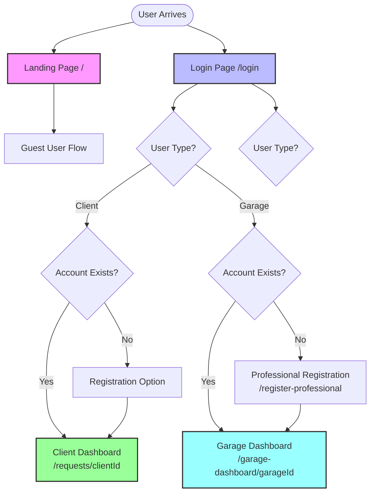
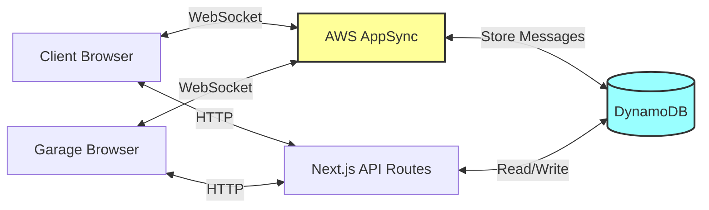

# NextService - System Flow Overview

## High-Level Architecture

This document provides a high-level overview of all user flows in the NextService application.

## User Types

1. **Guest User (Επισκέπτης)** - Unauthenticated users creating service requests
2. **Logged-in Client (Συνδεδεμένος Πελάτης)** - Authenticated clients managing requests
3. **Garage (Συνεργείο)** - Professional service providers

## System Entry Points

## Main User Flows

### 1. Guest User Flow
**Path:** Landing Page → Car Details → Car Specifications → Service Request Creation → Requests Page

- Creates service request without authentication
- Receives temporary `clientId`
- Can register later to receive notifications

### 2. Logged-in Client Flow
**Path:** Login → Requests Page → View Requests / Chat / Accept Offers

- Email-based authentication
- Manages service requests
- Communicates with garages via real-time chat
- Accepts/rejects offers from garages

### 3. Garage Flow
**Path:** Login → Dashboard → View Available Requests → Make Offers → Chat with Clients

- Email-based authentication
- Views all pending service requests
- Creates offers with pricing and availability
- Communicates with clients via real-time chat

## Communication Architecture

## Data Flow

1. **Service Request Creation:**
   - Client/Guest → API Route → DynamoDB (ServiceRequests, Vehicles, Clients tables)
   - SMS notifications to garages (currently disabled)

2. **Offer Creation:**
   - Garage → API Route → DynamoDB (Offers table)
   - Client sees offer in requests page

3. **Real-time Chat:**
   - Client/Garage → AWS AppSync → DynamoDB (Messages table)
   - Real-time updates via WebSocket subscriptions

4. **Offer Acceptance:**
   - Client → API Route → DynamoDB (Updates ServiceRequest and Offer statuses)
   - Status changes to "appointment"

## Authentication & Session Management

- **Clients:** `clientId` stored in `localStorage`
- **Garages:** `garageId` stored in `localStorage`
- **User Context:** React Context API manages user state
- **No traditional JWT tokens** - ID-based session management

## Key API Endpoints

- `/api/service-request` - Create service request
- `/api/requests` - Get client requests
- `/api/garage/available-requests` - Get available requests for garage
- `/api/garage/offers` - Create/manage offers
- `/api/chat/[requestId]/messages` - Chat messages
- `/api/requests/[requestId]/accept-offer` - Accept offer

## Detailed Flow Diagrams

For detailed flow diagrams, see:
- [Guest User Flow](./guest-user-flow.md)
- [Client Flow](./client-flow.md)
- [Garage Flow](./garage-flow.md)
- [Communication Flow](./communication-flow.md)
- [State Transitions](./state-diagram.md)

