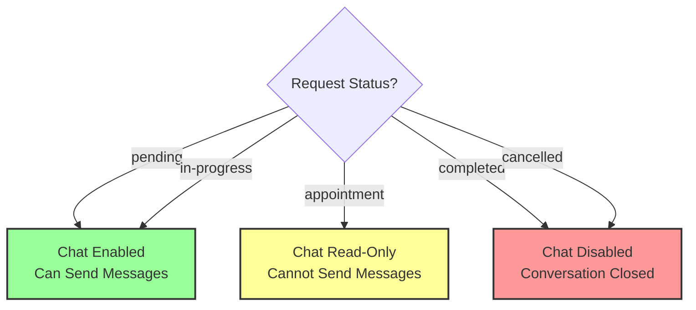
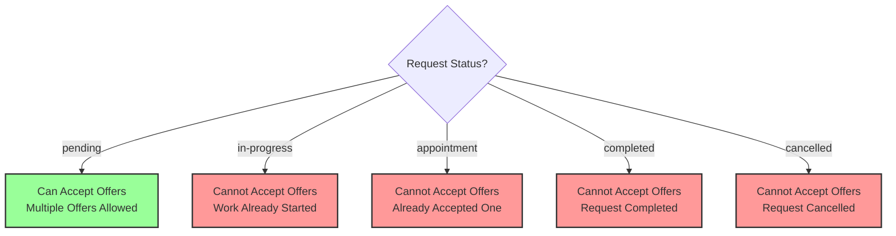
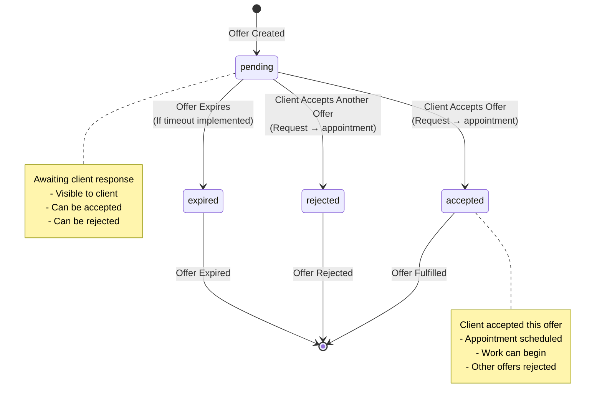

# Service Request State Transitions

## Overview

This document describes the state machine for service requests, including all possible status transitions and the events that trigger them.

## Service Request Statuses

1. **pending** - Initial state, awaiting garage offers
2. **in-progress** - Service work has begun
3. **appointment** - Client accepted an offer, appointment scheduled
4. **completed** - Service work finished
5. **cancelled** - Request cancelled by client or system

## State Transition Diagram

```mermaid
stateDiagram-v2
    [*] --> pending: Service Request Created
    
    pending --> appointment: Client Accepts Offer<br/>(PATCH /api/requests/{id}/accept-offer)
    pending --> in-progress: Garage Starts Work<br/>(Manual Update)
    pending --> cancelled: Client Cancels Request<br/>(Manual Update)
    
    appointment --> in-progress: Garage Starts Work<br/>(Manual Update)
    appointment --> cancelled: Client/Garage Cancels<br/>(Manual Update)
    
    in-progress --> completed: Garage Completes Work<br/>(Manual Update)
    in-progress --> cancelled: Work Cancelled<br/>(Manual Update)
    
    completed --> [*]
    cancelled --> [*]
    
    note right of pending
        Initial state
        - Can receive offers
        - Chat enabled
        - Can accept offers
    end note
    
    note right of appointment
        Offer accepted
        - Chat read-only
        - Appointment scheduled
        - Cannot accept other offers
    end note
    
    note right of in-progress
        Work started
        - Service in progress
        - Chat may be enabled
        - Cannot accept new offers
    end note
```

## Detailed State Transitions

### 1. pending → appointment

**Trigger:** Client accepts an offer

**API:** `PATCH /api/requests/{requestId}/accept-offer`

**Request:**
```json
{
  "offerId": "offer-...",
  "appointmentDate": "2024-12-25",
  "appointmentPrice": 150
}
```

**Backend Process:**
1. Update ServiceRequest:
   - `status` → `"appointment"`
   - `acceptedOfferId` → offerId
   - `appointmentDate` → date
   - `appointmentPrice` → price
   - `updatedAt` → current timestamp

2. Update All Offers:
   - Accepted offer → `status: "accepted"`
   - All other offers → `status: "rejected"`

**Side Effects:**
- Chat becomes read-only
- Request moves to "Ραντεβού" tab
- Garage notified (via status change)

**UI Changes:**
- Request card shows appointment icon
- Chat shows read-only notice
- Cannot accept other offers

### 2. pending → in-progress

**Trigger:** Manual update by garage or admin

**Current Implementation:** Manual database update (no API endpoint yet)

**Future Implementation:**
- Could be triggered when garage starts work
- Could be automatic after appointment date

**Side Effects:**
- Service work has begun
- May disable offer acceptance
- Chat may remain enabled

### 3. pending → cancelled

**Trigger:** Client or system cancels request

**Current Implementation:** Manual database update (no API endpoint yet)

**Possible Triggers:**
- Client cancels request
- System timeout (if implemented)
- Duplicate request cleanup

**Side Effects:**
- All offers marked as rejected/expired
- Chat may be disabled
- Request moved to "Closed" tab

### 4. appointment → in-progress

**Trigger:** Garage starts work on scheduled appointment

**Current Implementation:** Manual database update (no API endpoint yet)

**Side Effects:**
- Work has begun
- Appointment date has passed
- Service in progress

### 5. appointment → cancelled

**Trigger:** Client or garage cancels appointment

**Current Implementation:** Manual database update (no API endpoint yet)

**Possible Scenarios:**
- Client cancels before appointment
- Garage cannot fulfill appointment
- Rescheduling (would create new request)

**Side Effects:**
- Appointment cancelled
- Offers may be reset to pending
- Chat may be re-enabled

### 6. in-progress → completed

**Trigger:** Garage completes service work

**Current Implementation:** Manual database update (no API endpoint yet)

**Side Effects:**
- Service finished
- Request moved to "Closed" tab
- Chat may be disabled
- Client can review/rate (if implemented)

### 7. in-progress → cancelled

**Trigger:** Work cancelled during progress

**Current Implementation:** Manual database update (no API endpoint yet)

**Possible Scenarios:**
- Client cancels mid-service
- Garage cannot complete work
- Technical issues

**Side Effects:**
- Work stopped
- Request moved to "Closed" tab
- May require refund/compensation logic

## Status-Based Behavior

### Chat Behavior by Status



### Offer Acceptance by Status



### UI Tab Organization

**Open Tab:**
- `pending` status
- `in-progress` status

**Appointment Tab:**
- `appointment` status

**Closed Tab:**
- `completed` status
- `cancelled` status

## Offer Status Lifecycle

Offers have their own status lifecycle, independent but related to request status:



## Status Update API Endpoints

### Current Endpoints

**Accept Offer (pending → appointment):**
- `PATCH /api/requests/{requestId}/accept-offer`

### Future Endpoints (Not Yet Implemented)

**Start Work (pending/appointment → in-progress):**
- `PATCH /api/requests/{requestId}/start-work`

**Complete Work (in-progress → completed):**
- `PATCH /api/requests/{requestId}/complete`

**Cancel Request (any → cancelled):**
- `PATCH /api/requests/{requestId}/cancel`

## Status Validation

### Current Validation

**Chat API:**
```typescript
// Prevent sending messages when status is appointment
if (requestItem.status === 'appointment') {
  return NextResponse.json(
    { error: 'Chat is read-only for appointments' },
    { status: 403 }
  )
}
```

**Offer Acceptance:**
- Only allowed when status is `pending`
- Automatically updates status to `appointment`

### Future Validation

**Status Transitions:**
- Validate allowed transitions
- Prevent invalid state changes
- Log all status changes for audit

## Status Icons and Colors

**UI Representation:**

| Status | Icon | Color | Greek Text |
|--------|------|-------|------------|
| `pending` | Clock | Yellow | Εκκρεμές |
| `in-progress` | Clock | Blue | Σε Εξέλιξη |
| `appointment` | Calendar | Blue | Ραντεβού |
| `completed` | Check Circle | Green | Ολοκληρωμένο |
| `cancelled` | X Circle | Red | Ακυρωμένο |

**Component:** `src/app/requests/components/RequestsPage.tsx`

```typescript
const getStatusIcon = (status: string) => {
  switch (status) {
    case 'appointment': return <HiCalendar className="h-5 w-5 text-blue-600" />
    case 'pending': return <HiClock className="h-5 w-5 text-yellow-600" />
    case 'in-progress': return <HiClock className="h-5 w-5 text-blue-600" />
    case 'completed': return <HiCheckCircle className="h-5 w-5 text-green-600" />
    case 'cancelled': return <HiXCircle className="h-5 w-5 text-red-600" />
  }
}
```

## Database Schema

### ServiceRequests Table

**Status Field:**
- Type: String
- Values: `'pending' | 'in-progress' | 'appointment' | 'completed' | 'cancelled'`
- Default: `'pending'`
- Indexed for filtering

**Related Fields:**
- `acceptedOfferId`: string (set when status → appointment)
- `appointmentDate`: string (set when status → appointment)
- `appointmentPrice`: number (set when status → appointment)
- `updatedAt`: string (updated on every status change)

## State Machine Rules

### Valid Transitions

```
pending → appointment ✓
pending → in-progress ✓
pending → cancelled ✓
appointment → in-progress ✓
appointment → cancelled ✓
in-progress → completed ✓
in-progress → cancelled ✓
```

### Invalid Transitions

```
appointment → pending ✗
completed → any ✗
cancelled → any ✗
in-progress → appointment ✗
```

### Business Rules

1. **Once completed or cancelled, cannot change status**
2. **Appointment status locks chat to read-only**
3. **Only one offer can be accepted per request**
4. **Status changes should be logged for audit**

## Key Files

- `src/app/api/requests/[requestId]/accept-offer/route.ts` - Accept offer endpoint
- `src/app/requests/components/RequestsPage.tsx` - Status display logic
- `src/app/requests/components/RequestCard.tsx` - Status badge display
- `src/app/garage-dashboard/[garageId]/chat/[requestId]/components/ChatPage.tsx` - Read-only check

## Future Enhancements

1. **Automatic Status Transitions:**
   - Auto `in-progress` after appointment date
   - Auto `completed` after work duration
   - Auto `cancelled` after timeout

2. **Status History:**
   - Track all status changes
   - Show status change timeline
   - Audit log

3. **Status Notifications:**
   - Notify on status changes
   - Email/SMS alerts
   - Push notifications

4. **Status Workflows:**
   - Custom workflows per category
   - Status-based automation
   - Conditional transitions


